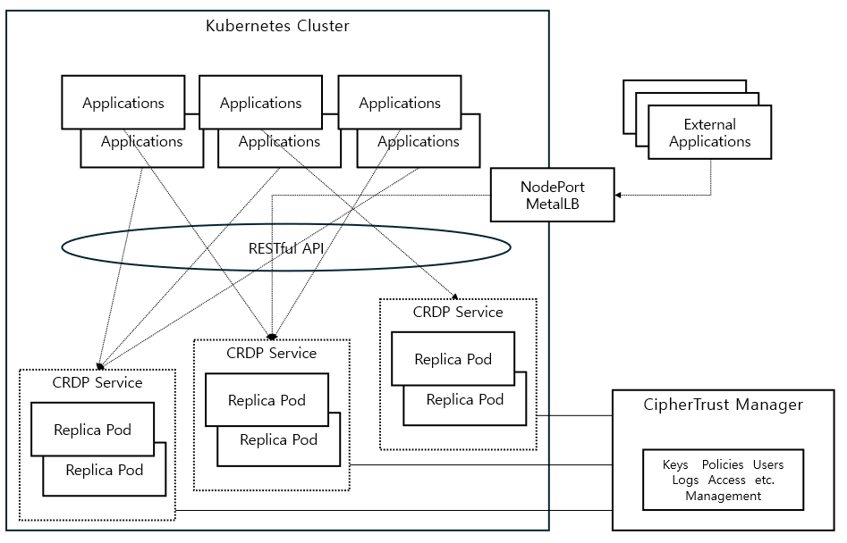

# CRDP WebUI

[](https://github.com/sjrhee/crdp_webui/actions/workflows/ci.yml)

## 개요

- 목적: k8s 클러스터 내부의 애플리케이션에서 CRDP Protect/Reveal 기능을 빠르게 시험·데모하기 위한 최소 Web UI
- 백엔드: FastAPI (Python)
- 프론트엔드: React + Vite (TypeScript)
- 배포: Helm Chart (Kubernetes), 선택적으로 Ingress/MetalLB 사용

## 구성

- 목적: k8s 클러스터 내부의 애플리케이션에서 CRDP Protect/Reveal 기능을 빠르게 시험·데모하기 위한 최소 Web UI
- 백엔드: FastAPI (Python)
- 프론트엔드: React + Vite (TypeScript)
- 배포: Helm Chart (Kubernetes), 선택적으로 Ingress/MetalLB 사용

## 프로젝트 구조

```
backend/           # FastAPI 앱 (API, 서비스, 스키마)
frontend/          # React(Vite) 프론트엔드
helm/react-fastapi # Helm 차트 (백/프론트 동시 배포)
docs/              # 트러블슈팅/런북 문서
```

## 요구사항

## 설치 및 설정

- 백엔드 의존성 설치: `pip install -r backend/requirements.txt`
- 프론트엔드 의존성 설치: `npm install` (디렉터리: `frontend/`)
## 아키텍처 (Architecture)

아래 다이어그램은 클러스터 내 CRDP 서비스(복수의 CRDP 인스턴스/서비스), MetalLB/Ingress, 그리고 CRDP를 사용하는 애플리케이션들이 어떻게 연결되는지 보여줍니다.



요점 요약:
- 여러 CRDP 서비스가 클러스터 내부에서 Replica Pod로 동작하고, 각 서비스는 내부 ClusterIP로 라우팅됩니다.
- 외부 애플리케이션은 MetalLB/Ingress를 통해 RESTful API(예: 이 웹 UI)를 호출합니다.
- Protect/Reveal API는 CRDP의 v1 엔드포인트(예: :32082)를 사용하고, Healthz는 별도의 포트(:32080)에서 제공될 수 있습니다.

네임스페이스 및 포트 관례:
- 네임스페이스: `crdp-webui` (배포/운영 리소스는 이 네임스페이스로 통일)
- Protect/Reveal API 포트: 기본 `CRDP_API_PORT=32082`
- Healthz 포트: 기본 `CRDP_HEALTHZ_PORT=32080` (Healthz는 별도 포트로 노출될 수 있음)

검증/디버그(간단 명령):
- 클러스터 내부에서 healthz 직접 호출(예: HTTP):
	- curl -sS http://192.168.0.231:32080/healthz
- 백엔드 헬스 체크 엔드포인트 호출(포트포워딩 또는 인클러스터):
	- kubectl -n crdp-webui port-forward svc/crdp-webui-react-fastapi-backend 8000:8000
	- curl -sS "http://localhost:8000/api/crdp/health?host=192.168.0.231&port=32082&policy=P03" | jq .

- 환경 변수(백엔드):
	- `CRDP_API_HOST` (기본: 192.168.0.231)
	- `CRDP_API_PORT` (기본: 32082)
	- `CRDP_PROTECTION_POLICY` (기본: P03)

## 🚀 Quick Start

```bash
# 1. 저장소 클론
git clone https://github.com/sjrhee/crdp_webui.git
cd crdp_webui

# 2. 환경 설정
cp backend/.env.example backend/.env
# backend/.env 파일 편집 (CRDP 설정)

# 3. 의존성 설치
make setup

# 4. 개발 서버 실행
make dev
```

접속: http://localhost:5173/protect-reveal


## 주요 기능

- 단일 Protect/Reveal
- 벌크 Protect/Reveal
- Protect → Reveal 자동 채우기(연동)
- 응답 디버그 정보(요청/응답/URL/헤더/상태코드) 표시

## 사용법

- Protect 탭에서 평문을 입력하고 실행 → 암호문을 확인
- Reveal 탭에서 암호문을 입력하고 실행 → 평문을 확인
- 벌크 탭에서는 줄바꿈(또는 배열) 기반으로 여러 건 처리

## 기본 실행

- 백엔드: `http://localhost:8000`
- 프론트엔드: `http://localhost:5173/protect-reveal`
- 주요 API:
	- `POST /api/crdp/protect`
	- `POST /api/crdp/reveal`
	- `POST /api/crdp/protect-bulk`
	- `POST /api/crdp/reveal-bulk`
	- `GET  /api/crdp/health`

## 에러 처리

- CRDP 연결 실패: `CRDP_API_HOST/PORT` 값을 확인하세요.
- CORS 오류: 백엔드 `CORS_ORIGINS` 환경 변수/설정을 점검하세요.
- Ingress 접속 불가(선택 배포 시): Ingress 주소/hosts 파일 매핑을 확인하세요.

## 개발 및 테스트

백엔드 테스트 실행:

```bash
cd backend
pip install -r requirements.txt
pytest -q
```

프론트엔드: 현재 별도 테스트 러너는 포함되어 있지 않습니다.

## 사용 방법

- UI 기반 테스트: 프론트엔드 화면에서 Protect/Reveal 실험
- API 기반 테스트: 위 API 엔드포인트에 JSON payload로 직접 호출

### 배포(도커)

아래는 예시입니다. 환경에 맞게 레지스트리 주소/태그를 변경하세요.

```bash
# 백엔드 이미지 빌드/푸시 (예: 로컬 레지스트리 192.168.0.231:5001)
docker build -t 192.168.0.231:5001/backend:<TAG> ./backend
docker push 192.168.0.231:5001/backend:<TAG>

# 프론트엔드 이미지 빌드/푸시
docker build -t 192.168.0.231:5001/frontend:<TAG> ./frontend
docker push 192.168.0.231:5001/frontend:<TAG>

# (선택) 단독 실행 예시
docker run -d --name crdp-backend -p 8000:8000 \
	-e CRDP_API_HOST=192.168.0.231 -e CRDP_API_PORT=32082 -e CRDP_PROTECTION_POLICY=P03 \
	192.168.0.231:5001/backend:<TAG>

docker run -d --name crdp-frontend -p 8080:80 \
	192.168.0.231:5001/frontend:<TAG>
```

### 배포(docker-compose)

로컬에서 백엔드/프론트엔드를 함께 올립니다. `docker-compose.yml`은 다음을 포함합니다:
- backend: FastAPI (포트 8000 노출, CORS는 8080에 맞춤)
- frontend: Nginx로 정적 서빙 + `/api/*`를 `backend:8000/api/*`로 프록시

실행/중지:

```bash
# 빌드 후 백그라운드 실행
docker compose up -d --build

# 로그 보기
docker compose logs -f

# 중지 및 삭제
docker compose down
```

접속:
- 프론트엔드: http://localhost:8080/protect-reveal
- 백엔드: http://localhost:8000/api/crdp/health

환경 변수 변경(예: CRDP 연결 정보):
- `docker-compose.yml`의 backend 환경변수 `CRDP_API_HOST/PORT/CRDP_PROTECTION_POLICY` 값을 수정하거나, 실행 시 `-e`로 덮어쓸 수 있습니다.

### 배포(Helm)

로컬 레지스트리와 Ingress 환경을 고려한 값 파일: `helm/react-fastapi/values-local-registry.yaml`

```bash
kubectl create namespace crdp-webui || true

# 필요 시 values-local-registry.yaml에서 이미지 태그/레지스트리/ingress host 조정
helm upgrade --install crdp-webui ./helm/react-fastapi \
	-n crdp-webui \
	-f ./helm/react-fastapi/values-local-registry.yaml

# 확인
kubectl get pods,svc,ingress -n crdp-webui
# Ingress: MetalLB가 할당한 IP로 접속 (예: http://crdp-webui.local 또는 http://<할당IP>)
```

참고
- MetalLB는 LoadBalancer IP를 할당합니다. DNS가 없으면 IP로 직접 접근 가능합니다.
- 호스트명 사용 시 클라이언트 `/etc/hosts`에 `192.168.0.240 crdp-webui.local` 추가(예시 IP).

#### 빌드 후 Helm 배포(원클릭 스크립트)

이미지를 빌드/푸시하고 Helm으로 배포까지 한 번에 실행하는 스크립트를 제공합니다.

```bash
# (옵션) 환경 지정
export REGISTRY=192.168.0.231:5001
export TAG=$(date +%Y%m%d-%H%M%S)   # 미지정 시 자동 생성

# 실행
bash scripts/build_and_deploy.sh

# (옵션) 빌드/푸시 스킵
# SKIP_BUILD=1 SKIP_PUSH=1 bash scripts/build_and_deploy.sh
```

스크립트는 다음을 수행합니다.
- backend/frontend Docker 이미지 빌드 → REGISTRY로 푸시
- Helm upgrade/install 실행(`values-local-registry.yaml` + 이미지 태그/레지스트리 `--set` 오버라이드)
- 현재 네임스페이스 리소스 요약 출력

### 언인스톨

```bash
helm uninstall crdp-webui -n crdp-webui
kubectl delete namespace crdp-webui
```

## 문제 해결 가이드

- 클러스터/배포 관련 이슈: `docs/runbooks/k8s-helm-runbook.md`
- 레지스트리/이미지 풀 이슈: `docs/troubleshooting/containerd-http-registry-setup.md`
- 기타는 `docs/troubleshooting/README.md` 참고
